# Enterprise Log Analyzer Architecture Flowchart

```mermaid
%%{init: {'theme':'base', 'themeVariables': { 'fontSize':'18px', 'fontFamily':'Arial'}, 'flowchart': {'curve':'basis', 'padding':50}}}%%
flowchart TB
  %% Style definitions
  classDef thread fill:#eef,stroke:#88f,stroke-width:3px,padding:20px
  classDef loop fill:#f7faff,stroke:#99c,stroke-width:3px,padding:20px
  classDef ext fill:#fef6e4,stroke:#e5a50a,stroke-width:3px,padding:20px
  classDef store fill:#eefbf3,stroke:#0a8f3e,stroke-width:3px,padding:20px
  classDef stream fill:#ffffff,stroke:#999,stroke-width:2px,padding:15px
  classDef service fill:#eff7ff,stroke:#1f77b4,stroke-width:3px,padding:20px

  %% Main FastAPI Application
  A[" <br/>FastAPI app - Uvicorn<br/> "]:::service

  %% Startup attachments
  A --> B1[" <br/>attach_consumer<br/> "]:::service
  A --> B2[" <br/>attach_issues_aggregator<br/> "]:::service
  A --> B3[" <br/>attach_producers<br/> "]:::service
  A --> B4{" <br/>ENABLE_ENRICHER?<br/> "}:::service
  B4 -->|true| B4a[" <br/>attach_enricher<br/> "]:::service
  A --> B5[" <br/>attach_cluster_enricher<br/> "]:::service
  A --> B6[" <br/>attach_prototype_improver<br/> "]:::service
  A --> B7{" <br/>ENABLE_AUTOMATIONS?<br/> "}:::service
  B7 -->|true| B7a[" <br/>attach_automations<br/> "]:::service
  A --> B8[" <br/>install_request_logging<br/> "]:::service
  A --> B9[" <br/>LLM healthcheck<br/> "]:::service
  A --> API_TELE[" <br/>Telemetry API<br/> "]:::service

  %% External systems and stores
  R1[(" <br/>Redis<br/> ")]:::store
  DB[(" <br/>PostgreSQL DataSource<br/> ")]:::store
  H1[(" <br/>Redis Hashes<br/>alert:id with TTL<br/> ")]:::store

  %% Redis Streams
  S1([" <br/>logs stream<br/> "]):::stream
  S2([" <br/>metrics stream<br/> "]):::stream
  S3([" <br/>issues_candidates stream<br/> "]):::stream
  S4([" <br/>clusters_candidates stream<br/> "]):::stream
  S5([" <br/>alerts stream<br/> "]):::stream
  
  R1 -.-> S1
  R1 -.-> S2
  R1 -.-> S3
  R1 -.-> S4
  R1 -.-> S5

  %% ChromaDB Collections
  C1[(" <br/>ChromaDB<br/>templates_os<br/> ")]:::store
  C2[(" <br/>ChromaDB<br/>logs_os<br/> ")]:::store
  C3[(" <br/>ChromaDB<br/>proto_os<br/> ")]:::store

  %% External integrations
  OTEL[(" <br/>OTLP Collector<br/> ")]:::ext
  OTelSDK[" <br/>OTel SDK<br/>PeriodicExporter<br/> "]:::loop
  LLM[(" <br/>LLM Provider<br/>OpenAI/Ollama<br/> ")]:::ext

  %% External data sources
  EXT_DD[(" <br/>Datadog API<br/> ")]:::ext
  EXT_SPL[(" <br/>Splunk API<br/> ")]:::ext
  EXT_TE[(" <br/>ThousandEyes API<br/> ")]:::ext
  EXT_SNMP[(" <br/>SNMP Targets<br/> ")]:::ext
  EXT_DCIM[(" <br/>DCIM HTTP<br/> ")]:::ext
  EXT_TG[(" <br/>Telegraf Agents<br/> ")]:::ext

  %% Automation providers
  E_AT[" <br/>Ansible Tower<br/> "]:::ext
  E_TFC[" <br/>Terraform Cloud<br/> "]:::ext
  E_SNOW[" <br/>ServiceNow<br/> "]:::ext

  %% Thread 1: Consumer
  CSM[" <br/><br/>consume_logs<br/>consumer-thread<br/><br/> "]:::thread
  B1 --> CSM
  CSM -->|XREADGROUP| S1
  CSM -->|parse & template| C2
  CSM -->|nearest_prototype| C3
  CSM -->|rule signals| C1
  CSM -->|normalize metrics| S2
  CSM -->|export_metrics| OTelSDK
  OTelSDK --> OTEL
  CSM -->|upsert logs| C2
  CSM -->|per-line candidates| S3
  CSM -->|XACK| S1

  %% Thread 2: Issues Aggregator
  IA[" <br/><br/>run_issues_aggregator<br/>issues-aggregator-thread<br/><br/> "]:::thread
  B2 --> IA
  IA -->|XREADGROUP| S1
  IA -->|parse & template| C2
  IA -->|online clustering| C3
  IA -->|update cluster_id| C2
  IA -->|inactivity timeout| S3
  IA -->|cluster threshold| S4

  %% Thread 3: Producers Manager
  PM[" <br/><br/>ProducerManager<br/>producers-thread<br/><br/> "]:::thread
  HB[" <br/>_heartbeat loop<br/> "]:::loop
  PM --> HB
  
  P_FILE[" <br/>filetail producer<br/> "]:::service
  P_DD[" <br/>datadog producer<br/> "]:::service
  P_SPL[" <br/>splunk producer<br/> "]:::service
  P_TE[" <br/>thousandeyes producer<br/> "]:::service
  P_SNMP[" <br/>snmp producer<br/> "]:::service
  P_HTTP[" <br/>dcim_http producer<br/> "]:::service

  B3 -->|reconcile_all| DB
  DB -->|enabled sources| PM
  PM --> P_FILE
  PM --> P_DD
  PM --> P_SPL
  PM --> P_TE
  PM --> P_SNMP
  PM --> P_HTTP

  %% Producer I/O
  P_FILE -->|tail logs| S1
  EXT_DD --> P_DD
  P_DD -->|emit lines| S1
  EXT_SPL --> P_SPL
  P_SPL -->|stream lines| S1
  EXT_TE --> P_TE
  P_TE -->|emit lines| S1
  EXT_SNMP --> P_SNMP
  P_SNMP -->|emit JSON| S1
  EXT_DCIM --> P_HTTP
  P_HTTP -->|emit JSON| S1

  %% Telegraf HTTP ingestion
  EXT_TG -->|POST /telemetry/telegraf| API_TELE
  API_TELE -->|auth via DataSource| DB
  API_TELE -->|enqueue| S1

  %% Thread 4: Enricher
  ENR[" <br/><br/>run_enricher<br/>enricher-thread<br/><br/> "]:::thread
  B4a --> ENR
  ENR -->|xreadgroup| S3
  ENR -->|neighbors from templates| C1
  ENR -->|HYDE queries & retrieve| C2
  ENR -->|classify_issue| LLM
  ENR -->|xadd alert| S5
  ENR -->|mirror hash with TTL| H1
  ENR -->|xack| S3

  %% Thread 5: Cluster Enricher
  CENR[" <br/><br/>run_cluster_enricher<br/>cluster-enricher-thread<br/><br/> "]:::thread
  B5 --> CENR
  CENR -->|xreadgroup| S4
  CENR -->|get prototype centroid| C3
  CENR -->|neighbors via centroid| C1
  CENR -->|HYDE + filter cluster| C2
  CENR -->|classify_cluster| LLM
  CENR -->|xadd alert| S5
  CENR -->|update prototype meta| C3
  CENR -->|xack| S4

  %% Thread 6: Prototype Improver
  PI[" <br/><br/>improve_prototypes<br/>prototype-improver-thread<br/><br/> "]:::thread
  B6 --> PI
  PI -->|fetch feedback set| R1
  PI -->|get alert hashes| H1
  PI -->|fetch embeddings| C2
  PI -->|cluster & build prototypes| C3
  PI -->|upsert prototypes| C3
  PI -->|clear processed set| R1

  %% Thread 7: Automations
  AUTO[" <br/><br/>run_automations<br/>automations-thread<br/><br/> "]:::thread
  B7a --> AUTO
  AUTO -->|xreadgroup| S5
  AUTO -->|match rules & cooldown| R1
  AUTO -->|execute/dry-run| E_AT
  AUTO -->|execute/dry-run| E_TFC
  AUTO -->|execute/dry-run| E_SNOW
  AUTO -->|xack| S5

  %% Telemetry toggles
  API_TELE -.->|toggle export| OTEL
  API_TELE -.->|toggle automations| AUTO
  API_TELE -.->|redfish toggle| EXT_DCIM
```

---

## Component Overview

### Background Threads
- **consumer-thread**: Main log consumer with parsing, templating, metrics normalization, and OTEL export
- **issues-aggregator-thread**: Groups logs into issues by component/PID, triggers online clustering
- **producers-thread**: Manages dynamic producer plugins (filetail, datadog, splunk, thousandeyes, snmp, dcim_http)
- **enricher-thread**: HYDE-powered issue classification using LLM
- **cluster-enricher-thread**: Cluster-level classification and prototype learning
- **prototype-improver-thread**: Periodic refinement of prototypes based on feedback
- **automations-thread**: Executes remediation workflows (Ansible, Terraform, ServiceNow)

### Redis Streams
- **logs**: Primary ingestion stream for all log/metric sources
- **metrics**: Normalized telemetry metrics (SNMP, DCIM, Telegraf)
- **issues_candidates**: Aggregated issues ready for LLM enrichment
- **clusters_candidates**: Clusters reaching classification threshold
- **alerts**: Final classified alerts with hardware/failure type

### ChromaDB Collections
- **templates_\<os\>**: Known log templates from offline clustering
- **logs_\<os\>**: Real-time log embeddings for retrieval
- **proto_\<os\>**: Cluster prototypes (centroids + metadata)

### Data Sources (Producers)
- **filetail**: Tails local log files (Linux.log, Mac.log, Windows_2k.log)
- **datadog**: Polls Datadog Logs API with configurable query
- **splunk**: Streams Splunk search results via export endpoint
- **thousandeyes**: Polls ThousandEyes alerts API
- **snmp**: Polls SNMP OIDs from configured hosts
- **dcim_http**: Polls DCIM/BMC HTTP endpoints (Redfish sensors, etc.)
- **telegraf**: Accepts HTTP POST ingestion from Telegraf agents

### Configuration
All runtime behavior controlled by environment flags:
- `ENABLE_ENRICHER`: Enable LLM-based issue enrichment
- `ENABLE_CLUSTER_ENRICHER`: Enable cluster-level classification
- `ENABLE_AUTOMATIONS`: Enable automation execution
- `ENABLE_PROTOTYPE_IMPROVER`: Enable periodic prototype refinement
- `ENABLE_METRICS_NORMALIZATION`: Enable metrics parsing & OTEL export
- `ENABLE_OTEL_EXPORT`: Runtime toggle for OTLP export
- `ENABLE_PER_LINE_CANDIDATES`: Emit candidates per log line (vs. issue aggregation)
